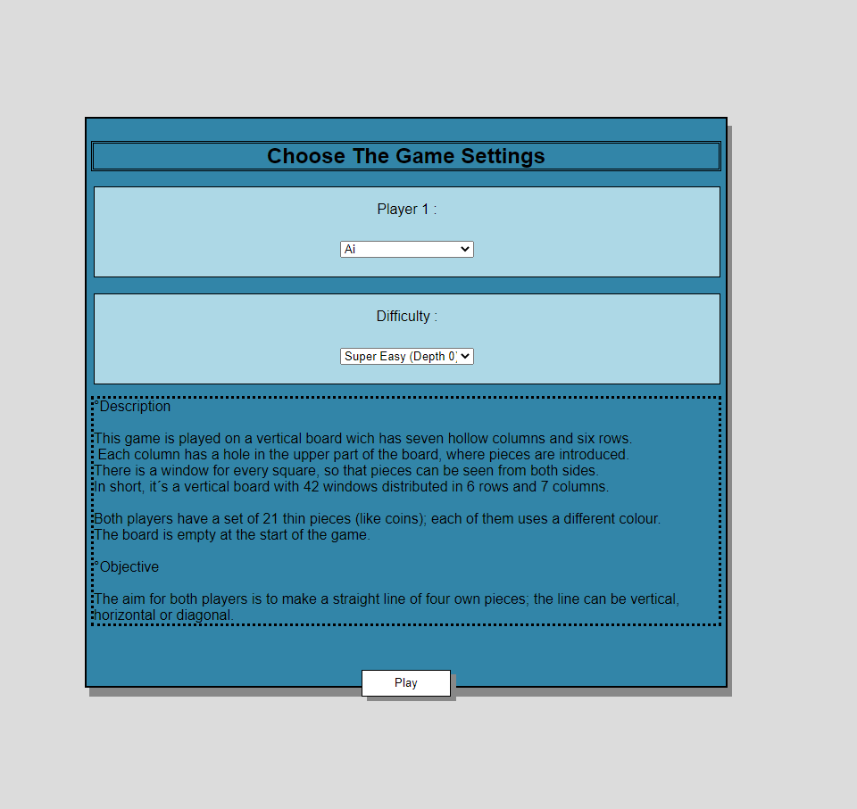
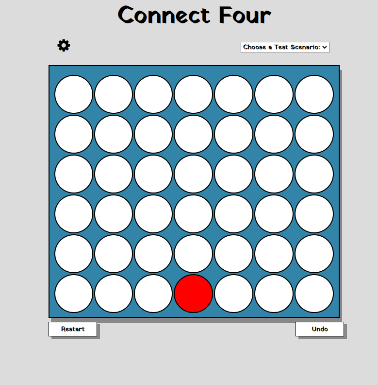

# CONNECT FOUR 
## Autor: Youssef Mellouli

## Einleitung
Das folgende Spiel ist eine einfache "connect-four"-Anwendung, die den gleichen Satz von Spielregeln wie das Original-Spiel enthält, mit der Integration der KI, die je nach Schwierigkeitsgrad gegen den Spieler antreten wird.
### Spielregeln
Ziel für beide Spieler ist es, eine gerade Linie aus vier eigenen Spielsteinen zu bilden; die Linie kann vertikal, horizontal oder diagonal sein. Vor dem Start entscheiden die Spieler, wer von ihnen der Anfänger sein wird; Im Spiel werden Die Züge abwechselnd , einer nach dem anderen, ausgeführt.
###implementierte Technologien
-Javalin :Web-Framework für Java und Kotlin
-Kotlin
-Html 
-JavaScript
-CSS
### Bedienungsanleitung
- GameStart Screenshot: 
 
- Board Screenshot: 
 

Wenn der Benutzer die App ausführt, wird er auf die html-Seite 'Choice.html' umgeleitet. Auf dieser Seite werden die "Beschreibung" und das "Ziel" unten in der Spieleinstellungsbox des Spiels angezeigt.
Auf der gleichen Seite kann der Benutzer auch wählen, wer als erster "Player 1" spielen darf, sowie die Spielschwierigkeit
"Game Difficulty".
Nach der Auswahl der Spieleinstellungen wird der Benutzer über die Taste 'play' auf die Seite 'index.html' umgeleitet, wo das Spielbrett geladen wird.
- Wenn der Spieler einen Zug machen will, kann er dies ganz einfach tun, indem er auf ein beliebiges Feld auf dem Brett klickt. Danach füllt eine spezielle Methode das erste weiße Feld am unteren Rand der spalte mit einem gelben 'Coin'; Spielstück (das die Münze des menschlichen Spielers darstellt) .Gleich nachdem der menschliche Spieler seinen Zug gemacht hat, wird der Zug der KI automatisch geladen und füllt eine bestimmte Zelle im Brett aus.
- Das Spiel wird dann so lange fortgesetzt, bis der "menschliche" oder der "KI"-Spieler zuerst gewinnt.
Der Spieler wird durch ein Pop-up-Fenster benachrichtigt, dass das Spiel beendet ist, und nach dem Schließen des Fensters werden die Siegeszellen mit "W"-Buchstaben gefüllt, um das Auffinden der Siegmünzen zu erleichtern.  
- Der Benutzer kann jederzeit entweder die Partie neu starten, indem er auf die Taste"Restart" klickt, oder den letzten Zug, den er gemacht hat, rückgängig machen, indem er auf die Taste "Undo" klickt.
- wenn der Benutzer die "AI" als "Player 1" gewählt hat, dann wird das Programm, egal ob der Benutzer auf "Neustart" klickt oder die Züge so lange rückgängig macht, bis das Brett leer ist, automatisch den ersten Zug der "KI" aufrufen und das Brett ausfüllen.
- Wenn der Benutzer die Spieleinstellungen zu irgendeinem Zeitpunkt ändern möchte, kann er dies tun, indem er auf das "Einstellungen"-Symbol oben links im Spielbrett  klickt.
- Der Benutzer kann direkt nach dem Start des Spiels über "http://localhost:4000/index.html" auf die Seite "index.html" zugreifen, und wenn er dies tut, sind die Standardeinstellungen des Spiels :  
*Difficulty:Normal(Depth 2)
*Player 1 :Human

### Dateiübersicht
\build.gradle
\connect4\build.gradle
\connect4\src\BoardScreen.png
\connect4\src\README.md
\connect4\src\StartScreen.png
\connect4\src\main\kotlin\connect4\App.kt
\connect4\src\main\kotlin\connect4\Slot.kt
\connect4\src\main\resources\public\choice.html
\connect4\src\main\resources\public\code.js
\connect4\src\main\resources\public\index.html
\connect4\src\test\kotlin\connect4\AppTest.kt

# (LoC)
~~~
-------------------------------------------------------------------------------
Language                     files          blank        comment           code
-------------------------------------------------------------------------------
Kotlin                           2            422             78            898
HTML                             2             58              5            324
JavaScript                       1             42              0             96
-------------------------------------------------------------------------------
SUM:                             5            522             83           1318
-------------------------------------------------------------------------------
~~~
## Spiel-Engine (ENG)

Feature    | AB  | H+S | M  | k   | | Summe
-----------|-----|-----|-----|-----|------|----
Umsetzung  | 0 | 100 | 100 |   40 | 0 |
Gewichtung | 0 | 0.3 | 0.4 | 0.3 |  0.3 | 
Ergebnis   |  0 |  30 |  40 |   12 |   0 | **82%**

### Erläuterungen zur Implementierung
Die Klasse Attribute enthält 5 Attribute, die später in der Hauptmethode verwendet werden.
*Die Variable "slot" steht für den Slot, den der Benutzer füllen möchte.
*"color"-Variable stellt die Farbe der Münze des menschlichen Spielers dar 
*die Variable "Gewinner" zeigt an, ob es einen Fall von Sieg gibt 
*"aimove"-Variable steht für den Slot, den der Benutzer füllen möchte
*"aicolor"-Variable stellt die Farbe der Münze des KI-Spielers dar
*"Winslots" stellen die Slots des Sieges dar 
- - in der app-Datei enthält die "slots"-Liste vom Typ Slot alle Zellen
die von den "KI"- und "Human"-Spielern besetzt wurden.
- jede Zelle im html hat einen Wert, die Werte sind von 0 bis 41 nummeriert, von der oberen linken Zelle bis zur unteren rechten Zelle.
- Bei jedem Klick sendet der Client den Wert der Zelle an die Serverseite.
- dank der "filling()"-Methode wird das Programm dann bestimmen, welche Zelle im Forum ausgefüllt werden soll und prüft, ob die Spalte, auf die der Benutzer geklickt hat, bereits voll ist.
- der 'index' GET-Request sendet dann die auszufüllende Zelle sowie den Zug der 'KI' an den Client zurück. Der 'index'-Request prüft auch weiterhin, ob ein Fall von Sieg mit der 'checkvictory()'-Methode vorliegt. 
- Wenn die checkvictory()-Methode wahr ist, informiert der Server den Client und ein Pop-up erscheint, um den Spieler darüber zu informieren, dass die Partie beendet ist, und von diesem Zeitpunkt an kann der Spieler keine Züge mehr machen, es sei denn, er drückt auf " restart" oder " undo". 

- der "Restart"-GET-REQUEST ist für das Neustarten und Neuladen des Spielbretts verantwortlich 
- das 'UNDO' GET-REQUEST ist dafür verantwortlich, die 2 letzten Züge auf dem Brett rückgängig zu machen.
- das''SETTINGS" GET-REQUEST ist verantwortlich für das Laden der vom Benutzer gewählten Spieleinstellungen.
- das''bestMOVE()' bezieht sich auf die Minimax-Methode , es füllt jedes Mal die 'Ai'-Slots auf dem Brett und ruft weiterhin minimax() auf, um die Stellung zu prüfen, die die beste Punktzahl bietet.
- Die Scoringboard()-Methode ist für die Bewertung jedes Satzes von Zügen auf dem Brett verantwortlich.  
### Dokumentation zu den Test-Szenarien
## Tests (TST)

Szenario |  1  |  2  |  3  |  4  |  5  | Summe
---------|-----|-----|-----|-----|-----|-------
ok       |  X  |  X  |  X  |  X  |  X  | 1.0

Die Tests werden wie folgt ausgeführt:
- in der html gibt es einen Select-Tag mit der Aufschrift 'CHOOSE A TEST SCENARIO',sobald ein Szenario ausgewählt wurde, wird eine Spielsituation geladen und ein neuer Knopf mit der Aufschrift 'NEXT MOVE' erscheint .wann immer der Benutzer den nächsten Zug ausführen will, muss er den Knopf drücken und die Kommandozeilenkonsole auf die Ausgaben überprüfen.
- Variablen namens 'SCENARIO1,SCENARIO2....' wurden erstellt, um jedes Mal zu prüfen, ob der Testfall wahr ist.
- Die Konsole druckt zuerst die Züge aus, die zur Erstellung der Partie-Situation gemacht wurden, und dann wird bei jedem Klick auf 'NÄCHSTER ZUG' der gemachte Zug und der Testfall ausgedruckt, wenn er wahr ist.
- Sobald ein Testszenario ausgewählt wurde, kann der Benutzer das Spielbrett nicht mehr durch Anklicken seiner Zellen verändern und muss 'RESTART' drücken, um wieder spielen zu können.

## Hinweise
- in build.gradle musste Ich den slf4j Logger dependency importieren um 'json' bei Javalin zu verwenden
- einige Methoden wurden auch in Javascript für " das Neuladen der Seite " erstellt
Auch wenn der Benutzer auf die Schaltfläche "Zurück" klickt, werden keine Probleme auf dem Brett erscheinen.
- Einige Booleans wurden auch in Javascript erstellt, so dass bei mehrmaligem Klicken eines Benutzers die Antwort der neuen Anfrage erst dann angezeigt wird, wenn die Antwort der alten Anfrage bereits erfolgt ist (andernfalls werden in einer Spieleinstellung mit hoher Spieltiefe Probleme auf dem Brett angezeigt). 
- die Antwort der Tiefe(4) braucht etwa 3 Sekunden zum Laden 
-die Antwort der Tiefe(5) dauert etwa 10 Sekunden zum Laden 
- Wenn ein Testszenario funktioniert und der Benutzer die Seite neu lädt, entsteht manchmal ein Problem auf dem Brett, aber ein Neustart des Spiels bringt alles wieder in den Normalzustand.

